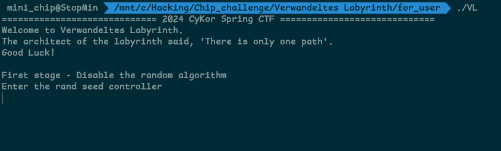

# Verwandeltes Labyrinth

## Usage

## Concept

- metamorphic code, anti-debugging, maze
- metamorhpic code는 악성 코드의 시그니처 값을 변경시키기 위해 사용되는 경우가 많지만, 정적 분석을 어렵게 하기 위한 방편으로 사용될 수 있습니다. 특히 input에 난수를 연산함으로써 분석을 더욱 어렵게 하였습니다. 다만, 역산이 가능해야 하므로 난수의 영향력이 정수 level에는 드러나지 않는 매우 작은 오차만 생성하도록 하여 `unsigned char` 자료형에서 다루는 0~255 범위의 input 값에 한해서는 역산이 가능하도록 구성했습니다.
- metamorhpic code가 정적 분석을 어렵게 만들지만 동적 분석의 난이도가 급격하게 오르지는 않기에 동적 분석을 방해하기 위한 anti-debugging 테크닉을 사용하였습니다. 서로 다른 4가지 유형의 anti-debugging이 적용되었으며, anti-debugging을 우회하기 위해 사용하는 형식적인 방법을 사용하였을 때는 이후 분석에 차질이 생기도록 설계하여 anti-debugging이 구현되는 원리를 이해해야 하게끔 하였습니다.
- 미로와 관련된 요소가 존재합니다. 문제의 중요한 부분인 난수 생성 알고리즘에 관여하며, 문제 풀이 과정에서 하나의 재미 요소로 작용하기를 기대하고 있습니다.

---

## Writeup

### 분석 - 실행해보기



rand seed controller를 입력하라고 합니다.


값을 7개를 입력하면 다음 과정으로 넘어갑니다.

Verify라고 하면서 path를 입력하라고 하는데, 수 차례 input을 입력해 봤지만 다음 과정으로 넘어가지 못합니다. 바이너리를 까봐야 하겠습니다.

### 분석 - IDA 정적 분석


main함수로 가기 이전에 init_array에 함수들이 존재합니다.

하나씩 살펴보겠습니다

**sub_1612 function**


byte_6060, byte_60E0, byte_60A0 배열들을 조작합니다. init_array 확인 없이 main부터 분석했다면 잘못된 데이터를 가지고 해석하게 됩니다.

**sub_1530 function**


sub_2775, sub_13A9는 함수 주소를 반환하는데, 이 함수가 존재하는 곳에서 데이터를 긁어와서 더한 뒤 검증을 수행합니다. 이는 코드 영역의 무결성 검사입니다. 연산하는 부분들에 대한 패치를 감지하며, 디버거가 bp를 삽입하는 것에 대해서도 감지할 수 있습니다.


bp를 건 경우에는 `exit()`에 의해 바로 프로세스가 종료되는 것을 확인할 수 있고, bp가 없는 경우에는 `exit()` 에 걸리지 않고 실행이 되는 것을 확인할 수 있습니다.

bp 외에도, 해당 코드 영역을 패치하게 된다면 exit()에 걸리게 됩니다. 향후 문제 바이너리를 패치하고 싶거나 bp를 걸어 디버깅하고 싶다면, 무결성 검증에 해당하는 부분도 같이 패치하여 무결성 검증을 우회해야 합니다.

**sub_13A9 function**


이곳에는 2개의 안티 디버깅이 적용되어 있습니다.

첫 번째로 “/proc/self/status”를 읽어서 “racer”문자열 위치를 찾은 뒤 해당 문자열에서 12칸 뒤의 값의 여부에 따라 다르게 동작하는데,

“/proc/self/status”에서는 본인 프로세스의 상태가 적혀있으며 그 중 “racer”문자열은 “TracerPid: <pid>”에 있는 “racer”가 되겠습니다. Process Status를 체크하는 방식의 안티 디버깅에 익숙하지 않다면 눈치채기 어려울 수 있겠습니다.

두 번째는 `ptrace()`인데 debugging 상태라면 -1을 반환하고 실제 실행 환경에서는 0을 반환합니다.

**main function**


간단한 main 함수입니다.

**sub_16B3 function**


main함수에서 첫 번째로 실행되는 함수입니다. 인트로 메세지를 출력하는 단순한 함수이지만, `srand(time(0))` 이 실행되면서 `rand()`함수의 반환값을 예측하기 어렵게 되었습니다. 그 외에 `byte_6060`, `byte_60E0`, `byte_60A0` 배열을 건드리는데, 이는 init_array에서 변조한 값을 원래대로 복원하게 됩니다.

**sub_24BA function**


seed controller를 입력하는 부분은 간단합니다.


7번 입력을 받아서 byte_6160배열을 조작합니다.

처음 실행해볼 때 해결하지 못한 Verify 관련 부분을 보겠습니다.


10 x 10 형태의 미로를 해결하는 것 처럼 보입니다.

시작점 (0,4)에서 도착점 (9,4)에 도달할때까지 while문을 돌면서 `sub_2260`을 실행하고, `sub_2260`에서는 입력한 값에 따라서 상하좌우로 현재 위치를 옮기게 됩니다.

maze를 표현하면 아래와 같습니다.

```python
    1, 1, 1, 1, 1, 1, 1, 1, 1, 1,
    1, 0, 0, 0, 1, 0, 1, 1, 0, 1,
    1, 0, 1, 0, 1, 0, 0, 0, 0, 1,
    1, 0, 1, 0, 1, 0, 1, 1, 0, 1,
    0, 0, 0, 0, 1, 0, 0, 1, 0, 0,
    1, 0, 1, 0, 1, 1, 0, 1, 0, 1,
    1, 1, 0, 0, 1, 0, 0, 0, 1, 1,
    1, 1, 0, 1, 1, 0, 1, 1, 1, 1,
    1, 0, 0, 0, 0, 0, 0, 1, 1, 1,
    1, 1, 1, 1, 1, 1, 1, 1, 1, 1
```

여기서 처음 rand seed controller로 입력한 곳은 여기서 1이 더해져 있습니다.

0이 아닌 곳은 길이 아니게 되며, (0,4)에서 (9,4)로 가는 것이 목표입니다.

그리고, (4,2)의 경우에는 init_array에서 ptrace()로 인해 정상 실행 환경에서는 저기서 1이 더해진 값으로 벽이 됩니다.

오른쪽이 1, 아래가 2, 왼쪽이 3, 위쪽이 4입니다.

(4,0)에서 (9,4)로 가기 위한 input은 다음과 같습니다.

```python
1 4 4 4 1 1 2 2 2 2 2 3 2 2 1 1 1 4 4 1 4 4 3 4 4 1 1 1 2 2 1
```

다시 실행해 보겠습니다.


First stage를 넘긴 모습입니다. Contaminated stage에 도달했습니다.

**sub_2658 function**


다시 main으로 돌아가서 sub_2658을 실행하게 되는데, contaminated stage에 해당합니다. 세부 동작 방식은 First stage와 동일하며, input받는 controller 개수와 maze에 해당하는 data정도만 다릅니다.

maze입니다.

```python
  	1, 1, 1, 1, 1, 1, 1, 1, 1, 1,
    1, 1, 0, 0, 0, 0, 0, 0, 0, 1,
    1, 0, 0, 1, 0, 1, 0, 1, 0, 1,
    1, 0, 1, 0, 0, 0, 0, 1, 0, 1,
    0, 0, 0, 0, 0, 0, 0, 0, 0, 0,
    1, 0, 1, 0, 1, 0, 0, 1, 0, 1,
    1, 0, 0, 0, 1, 1, 0, 0, 0, 1,
    1, 0, 1, 0, 0, 0, 0, 1, 0, 1,
    1, 0, 0, 1, 0, 1, 0, 0, 0, 1,
    1, 1, 1, 1, 1, 1, 1, 1, 1, 1
```

오른쪽으로 계속 가면 될 것 같습니다.

```python
1 1 1 1 1 1
```

위 input으로 verify 해주겠습니다.

Final stage가 나오면서 flag를 입력할 수 있는 창이 나오게 됩니다.


아무 input이나 넣으면 당연하겠지만, 그냥 이렇게 종료됩니다.

**sub_2775 function (Final stage)**

이번 함수는 상당히 길고 복잡한 형태를 가지고 있습니다.


초기 부분을 살펴보면, flag를 입력 받고 500번의 loop가 돌아갑니다.


중간이 끼여 있는 `sub_1697()`의 경우 시간을 전역 변수에 기록합니다.


loop의 초반 부분입니다. v61 값을 `sub_1BCB()`에 따라 결정하고 그 값에 따라 s를 설정합니다.

sub_1BCB는 First stage의 maze와 관련되어 있습니다.


정리하면, maze에서 현재 위치에서 상 하 좌 우 중 갈 수 있는 곳을 `rand()` 로 랜덤하게 골라 반환합니다. 여기서 Verify labyrinth 과정과는 조금 다른 규칙이 몇 가지 존재합니다.

1. 미로의 가장자리를 뛰어 넘을 수 있습니다. 예를 들어서 (0, 4)에서 (9, 4)로 넘어갈 수가 있습니다.
2. 직전에 경유했던 지점은 선택하는 우선순위가 최하위입니다.

이렇게 상, 하, 좌, 우를 선택하여 0, 2, 3, 1을 각각 반환합니다.

이렇게 v61과 v13 값을 결정하게 됩니다.


v61값에 따라 s가 결정되었고, v13 값에 따라서도 분기가 생기게 됩니다. 그리고 어떤 분기를 가던지 s와 전역 변수에 존재하는 table을 가지고서 연산을 진행하게 됩니다.

`sub_1BCB` 의 반환값이 예측 불가능한 난수라면 상당히 곤란한 상황이 됩니다.


여기 disable the random algorithm라는 stage명의 의도를 이제 이해할 수 있을 것 같습니다.

First stage 입력으로 maze에 영향을 줄 수 있었습니다. 이 input으로 sub_1BCB의 난수 생성 알고리즘을 무력화시켜야 할 것으로 보입니다.

다시 maze를 갖고 오면 다음과 같습니다.

```python
    1, 1, 1, 1, 1, 1, 1, 1, 1, 1,
    1, 0, 0, 0, 1, 0, 1, 1, 0, 1,
    1, 0, 1, 0, 1, 0, 0, 0, 0, 1,
    1, 0, 1, 0, 1, 0, 1, 1, 0, 1,
    0, 0, 1, 0, 1, 0, 0, 1, 0, 0,
    1, 0, 1, 0, 1, 1, 0, 1, 0, 1,
    1, 1, 0, 0, 1, 0, 0, 0, 1, 1,
    1, 1, 0, 1, 1, 0, 1, 1, 1, 1,
    1, 0, 0, 0, 0, 0, 0, 1, 1, 1,
    1, 1, 1, 1, 1, 1, 1, 1, 1, 1
```

7개의 input으로 갈 수 있는 경로가 하나로 고정되게 만들어야 합니다.

여기서, 출발 지점을 막으면 안됩니다.

그렇다면 다음의 경우 경로를 하나로 완전 고정시킬 수 있습니다.

```python
    1, 1, 1, 1, 1, 1, 1, 1, 1, 1,
    1, 0, 0, 0, 1, 2, 1, 1, 2, 1,
    1, 0, 1, 0, 1, 0, 0, 0, 0, 1,
    1, 0, 1, 0, 1, 0, 1, 1, 0, 1,
    0, 0, 1, 0, 1, 0, 0, 1, 0, 0,
    1, 2, 1, 0, 1, 1, 0, 1, 2, 1,
    1, 1, 0, 0, 1, 0, 0, 2, 1, 1,
    1, 1, 0, 1, 1, 0, 1, 1, 1, 1,
    1, 2, 0, 0, 0, 0, 2, 1, 1, 1,
    1, 1, 1, 1, 1, 1, 1, 1, 1, 1
```

벽으로 새롭게 설정한 곳은 식별을 위해 2라고 표기하였습니다.

이렇게 벽을 막으면 경로를 하나로 만들 수 있고, 출발지점에서 도착지점까지 미로 가장자리를 넘지 않고 갈 수 있도록 해야 하는 verify도 통과할 수 있습니다.

이것 외에 다른 방법은 없어 보입니다.

maze를 위 상태로 만들기 위한 First stage input은 아래와 같습니다.

```python
51 81 86 67 15 18 58
1 4 4 4 1 1 2 2 2 2 2 3 2 2 1 1 1 4 4 1 4 4 3 4 4 1 1 1 2 2 1
```

그러면 난수는 아래와 같이 고정됩니다.

```python
1, 0, 0, 0, 1, 1, 2, 2, 2, 2, 2, 3, 2, 2, 1, 1, 1, 0, 0, 1, 0, 0, 3, 0, 0, 1, 1, 1, 2, 2, 1, 1
```

위 값이 계속 반복되며 난수가 뽑히게 됩니다.

이후 s에 가하는 연산에 `sub_20B3` 의 반환값도 관여하는데, 이는 Contaminated stage에서 설정한 maze에서 뽑히는 난수입니다.

```python
    1, 1, 1, 1, 1, 1, 1, 1, 1, 1,
    1, 1, 0, 0, 0, 0, 0, 0, 0, 1,
    1, 0, 0, 1, 0, 1, 0, 1, 0, 1,
    1, 0, 1, 0, 0, 0, 0, 1, 0, 1,
    0, 0, 0, 0, 0, 0, 0, 0, 0, 0,
    1, 0, 1, 0, 1, 0, 0, 1, 0, 1,
    1, 0, 0, 0, 1, 1, 0, 0, 0, 1,
    1, 0, 1, 0, 0, 0, 0, 1, 0, 1,
    1, 0, 0, 1, 0, 1, 0, 0, 0, 1,
    1, 1, 1, 1, 1, 1, 1, 1, 1, 1
```

5개의 벽을 세울 수 있는데, 5개의 벽으로 길을 하나로 확정 짓는 것은 어려워 보입니다. 해당 stage 명이 ????였기에 first stage와 같은 방식으로 해결하는 것이 아닐 수도 있습니다. 일단 flag만 구하면 되기 때문에 계속 분석을 진행하겠습니다.

먼저 v13이 3인 경우입니다.


sub_20B3에 의해 난수 값이 뽑히지만, 서로 다른 3개의 난수를 뽑고 나머지 한 개는 6에서 뽑은 3개의 난수를 뺀 값을 사용합니다. 6은 0+1+2+3인 것을 감안하면 서로 다른 4개의 난수를 뽑기 때문에 반드시 0, 1, 2, 3이 뽑히게 됩니다. 물론, 순서는 랜덤입니다.

하지만, 이후 코드를 살펴보면 하위 4bit를 rotate shift하는 로직인데 `4*j + random값` 인덱스의 s를 모두 rotate shift하며, shift하는 횟수도 table의 `4*j+ random값` 인덱스의 값만큼 shift합니다. 즉 그냥 s[4*j], s[4*j+1], s[4*j+2], s[4*j+3]번째 값을 table[4*j], table[4*j+1], table[4*j+2], table[4*j+3]만큼 rotate shift하게 됩니다. 난수가 의미가 없게 되죠.

그 다음 v13이 2인 경우입니다.


여기서도 `sub_20B3`으로 뽑힌 난수에 따라 분기가 진행됩니다. 아까와 같은 방식이라면 어느 분기를 가던 동일한 결과가 나오지 않을까 예상됩니다.

두 분기 모두 + 연산을 수행하고 있으며 220번 line의 코드까지 실행된다면 최종적으로 xor 연산이 됩니다. 어느 분기를 가던지 동일한 `+` 연산을 수행하므로 여기서도 난수가 의미가 없게 됩니다.

```python
덧셈 연산 해석

167번 line if문 내부의 코드는 다음을 의미합니다.
carry가 0이 될 때까지 아래 작업 수행
-^로 dst와 carry를 더함
-&를 이용해 carry가 발생할 수 있는 비트를 선별한 뒤 *2로 carry로 만듦

176번 line else문 내부의 코드는 덧셈을 비트 단위로 쪼개 놓은 것과 같습니다.
```

```python
xor 연산 해석

두 값을 더 한 뒤 carry에 해당하는 값을 빼주면 xor과 동일한 의미가 되게 됩니다.
```

v13이 1인 경우입니다.


여기서도 `sub_20B3` 으로 난수를 뽑습니다. 먼저, 0이 될 때까지 무한으로 난수를 뽑기 때문에 0이 뽑히게 되고, 그 뒤에 8번 동안 반복문을 돌면서 `sub_20B3() % 2` 값을 or 합니다.

예측하기 어려운 난수이기 때문에 단순하게 생각하면 2의 8승 분의 1의 확률로 v16 값이 0이 될 가능성이 있습니다. 2의 8승이면 256분의 1인데, 충분히 큰 확률입니다. 

하지만, 이 값은 s에 직접적으로 연산 되고 0이냐 1이냐에 따라 다른 결과를 야기하기 때문에 알아야만 하는 값입니다.

미로를 다시 보면,

```python
    1, 1, 1, 1, 1, 1, 1, 1, 1, 1,
    1, 1, 0, 0, 0, 0, 0, 0, 0, 1,
    1, 0, 0, 1, 0, 1, 0, 1, 0, 1,
    1, 0, 1, 0, 0, 0, 0, 1, 0, 1,
    0, 0, 0, 0, 0, 0, 0, 0, 0, 0,
    1, 0, 1, 0, 1, 0, 0, 1, 0, 1,
    1, 0, 0, 0, 1, 1, 0, 0, 0, 1,
    1, 0, 1, 0, 0, 0, 0, 1, 0, 1,
    1, 0, 0, 1, 0, 1, 0, 0, 0, 1,
    1, 1, 1, 1, 1, 1, 1, 1, 1, 1
```

0이 되기 위해서는 0이 한번 나온 뒤 8번 연속 0이 나와야 합니다. 이것을 미로의 관점에서 보면, `상(0)` 혹은 `하(2)` 방향으로 9번 연속 이동해야 합니다. 이 때 직전에 경유한 지점의 방향은 우선순위가 최 하위이기 때문에, `상 → 하` 혹은 `하 → 상` 으로 방향이 바뀌기 위해서는 막다른 길에 도달했을 때만 가능합니다. `상` 혹은 `하` 방향으로 움직였을 때 막다른 길로 가게 되는 경우는 (4, 8)로 가는 경우가 유일하며 이 경우 `하 → 상` 으로 움직인 이후 반드시 `좌` or `우` 로 움직여야 합니다. 방향이 바뀌지 않고 9번 연속 이동하려면 9칸 연속 뚫린 세로길이 존재해야 합니다. 하지만 이 또한 존재하지 않습니다.

즉, 9번 연속 0이 나올 가능성은 아예 없습니다. 안전한 난수가 아니기 때문에 이러한 제약 조건을 해석하면 값을 예측할 수 있는 경우가 존재합니다. 그렇기에 v16 변수의 값은 1로 확정됩니다.

이제 남은 코드 부분을 보겠습니다.

```c
v21 = ~(ptrace(PTRACE_TRACEME, 0LL, 0LL, 0LL) ^ (v16 << i1) & (unsigned __int8)(s[byte_6020[nn]] ^ *s));
s[byte_6020[nn]] ^= v21;
*s ^= v21;
```

여기서 “ptrace의 반환값은 실제 실행 환경이니 0이 되는 거 아닐까?"라고 생각할 수 있지만, 실제 실행 환경에서 ptrace는 -1을 반환합니다.

ptrace가 안티 디버깅 트릭으로써 작동하는 원리는 Self Debugging Code이기 때문입니다. 직접 디버깅을 시도해보고 디버깅 성공 여부에 따라서 디버깅을 성공하면 디버깅 중인 디버거가 없다고 판단, 실패하면 이미 디버거가 디버깅 중이라고 판단하는 원리입니다. init_array에서 이미 최초 ptrace가 실행된 바가 있습니다. 그렇기에 이후 ptrace에서는 최초 실행된 ptrace에 의해 -1을 반환하게 됩니다. UNIX 계열 OS에서는 1개의 프로세스에는 1개의 프로세스만 attach할 수 있습니다.  init_array에서 ptrace(PTRACE_TRACEME, )로 자기 자신을 attach했으며, 이후 다시 ptrace를 수행할 시에 이미 프로세스가 attach되어 있기 때문에 attach에 실패하며 -1을 반환하게 되는 것이죠.

만약 init_array에 있는 ptrace를 호출하지 않도록 패치하였다면, final stage에 있는 ptrace의 동작이 달라지게 되므로 final stage에 있는 ptrace까지 패치를 하거나 init_array에서 ptrace를 호출하되, 해당 ptrace의 반환값을 바꾸는 방향으로 패치를 진행해야 합니다.

ptrace의 반환값과 1로 확정된 v16값을 가지고 다시 코드를 보면 다음과 같습니다.

```c
v21 = ~(0xff ^ (1 << i1) & (unsigned __int8)(s[byte_6020[nn]] ^ *s));
s[byte_6020[nn]] ^= v21;
*s ^= v21;
```

&가 우선순위가 높기 때문에 &부터 보면, s[0]과 s[byte_6020[nn]]를 xor한 값과 (1 << i1)를 &하게 되는데 i1번째 bit만 남기고 다 0이 됩니다. s[byte_6020[nn]]과 s[0]의 i1번재 bit가 같으면 0, 다르면 1이 되겠네요. 이후 0xff를 xor후 ~하게 되는데 이 연산은 하지 않은 것과 동일합니다.

그 이후 s[0]과 s[byte_6020[nn]]에다가 v21을 각각  xor하게 되는데,

i1번째 bit가 같으면 아무 변화가 일어나지 않고, 다르면 비트가 반전되므로 s[0]과 s[byte_6020[nn]]의 i1번째 bit값을 switch하는 연산입니다. i1은 0~7까지므로 s[0]과 s[byte_6020[nn]]을 switch하는 코드로 해석할 수 있습니다.

마지막으로 v13이 0인 경우입니다.

```c
    	else
      {
        for ( i3 = 0; i3 <= 63; ++i3 )
        {
          v14 = sub_20B3();
          v19 = (unsigned __int8)s[i3] + (unsigned __int8)byte_60E0[i3];
          v24 = 1;
          if ( v14 )
          {
            if ( v14 == 1 )
            {
              for ( i4 = 0; i4 <= 2; ++i4 )
                v24 *= (unsigned int)sub_20B3() + 1;
              v28 = v24 + 0x10000;
              v1 = sub_20B3();
              v2 = sub_20B3() * v1;
              if ( v2 * (unsigned int)sub_20B3() == 16 )
              {
                v3 = sub_20B3();
                v4 = sub_20B3() * v3;
                v5 = sub_20B3() * v4;
                if ( v5 * (unsigned int)sub_20B3() == 32 )
                {
                  v28 -= (int)&sleep;
                  v19 &= 0x7Fu;
                }
              }
              else if ( s[i3] >= 0 )
              {
                v7 = 0;
                for ( i5 = 0; i5 <= 7; ++i5 )
                  v7 += ((int)(unsigned __int8)s[i3] >> i5) & 1;
                if ( v7 > 7u )
                {
                  for ( i6 = 0; i6 <= 63; ++i6 )
                    s[i6] = sub_20B3();
                }
              }
              else
              {
                byte_60E0[0] = 104;
                byte_60E1 = 105;
                byte_60E2 = 33;
                byte_60E3 = -1;
                byte_60E4 = 73;
                byte_60E5 = -1;
                byte_60E6 = 97;
                byte_60E7 = 109;
                byte_60E8 = -1;
                byte_60E9 = 109;
                byte_60EA = 105;
                byte_60EB = 110;
                byte_60EC = 105;
                byte_60ED = 95;
                byte_60EE = 99;
                byte_60EF = 104;
                byte_60F0 = 105;
                byte_60F1 = 112;
                byte_60F2 = -1;
                byte_60F3 = 116;
                byte_60F4 = 104;
                byte_60F5 = 101;
                byte_60F6 = -1;
                byte_60F7 = 97;
                byte_60F8 = 114;
                byte_60F9 = 99;
                byte_60FA = 104;
                byte_60FB = 105;
                byte_60FC = 116;
                byte_60FD = 101;
                byte_60FE = 99;
                byte_60FF = 116;
                byte_6100 = -1;
                byte_6101 = 111;
                byte_6102 = 102;
                byte_6103 = -1;
                byte_6104 = 116;
                byte_6105 = 104;
                byte_6106 = 105;
                byte_6107 = 115;
                byte_6108 = -1;
                byte_6109 = 99;
                byte_610A = 104;
                byte_610B = 97;
                byte_610C = 108;
                byte_610D = 46;
                byte_610E = -1;
                byte_610F = 83;
                byte_6110 = 111;
                byte_6111 = 114;
                byte_6112 = 114;
                byte_6113 = 121;
                byte_6114 = -1;
                byte_6115 = 98;
                byte_6116 = 117;
                byte_6117 = 116;
                byte_6118 = -1;
                byte_6119 = 110;
                byte_611A = 111;
                byte_611B = -1;
                byte_611C = 104;
                byte_611D = 105;
                byte_611E = 110;
                byte_611F = 116;
              }
              v29 = v19 * v28;
              v35 = 1;
              for ( i7 = 0; i7 <= 8; ++i7 )
                v35 *= (unsigned int)sub_20B3();
              v19 -= ((v35 - 0x800000) & (unsigned int)v29) >> 16;
            }
            else
            {
              for ( i8 = 0; i8 <= 2; ++i8 )
                v24 *= (unsigned int)sub_20B3() + 1;
              v30 = v24 + 0x8000;
              for ( i9 = 0; i9 <= 3; ++i9 )
                v30 += sub_20B3();
              v31 = (unsigned int)(v19 * v30) >> 22;
              for ( i10 = 0; i10 <= 6; ++i10 )
                LOBYTE(v31) = 2 * v31;
              LOBYTE(v19) = v19 - v31;
            }
          }
          else
          {
            for ( i11 = 0; i11 <= 3; ++i11 )
              v24 *= (unsigned int)sub_20B3() + 1;
            v25 = v24 + 0x20000;
            v8 = sub_20B3();
            if ( !v8 )
              sub_20B3();
            v26 = v19 * v25;
            v34 = 1;
            for ( i12 = 0; i12 <= 6; ++i12 )
              v34 *= (unsigned int)sub_20B3() + 1;
            i13 = (v34 - 0x1000000) & v26;
            if ( v8 != 2 )
            {
              if ( v8 * (unsigned int)sub_20B3() == 8 )
              {
                v0 = sub_20B3();
                v20 = v0 * sub_1BCB();
                v15 = sub_20B3();
                for ( i13 = sub_20B3(); v15 == i13; i13 = sub_20B3() )
                  ;
                v19 = v15 % i13 + v20;
              }
              else
              {
                while ( (unsigned __int8)sub_20B3() )
                  ;
              }
            }
            v19 -= i13 >> 17;
          }
          s[i3] = v19;
        }
      }
```

상당히 길기 때문에 부분 부분 해석하겠습니다.

초반 부분

```c
        for ( i3 = 0; i3 <= 63; ++i3 )
        {
          v14 = sub_20B3();
          v19 = (unsigned __int8)s[i3] + (unsigned __int8)byte_60E0[i3];
          v24 = 1;
          if ( v14 )
          {
```

sub_20B3()에 의해 분기가 나뉘어 집니다.

```c
            if ( v14 == 1 )
            {
              for ( i4 = 0; i4 <= 2; ++i4 )
                v24 *= (unsigned int)sub_20B3() + 1;
              v28 = v24 + 0x10000;
              v1 = sub_20B3();
              v2 = sub_20B3() * v1;
              if ( v2 * (unsigned int)sub_20B3() == 16 )
              {
                v3 = sub_20B3();
                v4 = sub_20B3() * v3;
                v5 = sub_20B3() * v4;
                if ( v5 * (unsigned int)sub_20B3() == 32 )
                {
                  v28 -= (int)&sleep;
                  v19 &= 0x7Fu;
                }
              }
              else if ( s[i3] >= 0 )
              {
                v7 = 0;
                for ( i5 = 0; i5 <= 7; ++i5 )
                  v7 += ((int)(unsigned __int8)s[i3] >> i5) & 1;
                if ( v7 > 7u )
                {
                  for ( i6 = 0; i6 <= 63; ++i6 )
                    s[i6] = sub_20B3();
                }
              }
              else
              {
                byte_60E0[0] = 104;
                byte_60E1 = 105;
                byte_60E2 = 33;
                byte_60E3 = -1;
                byte_60E4 = 73;
                byte_60E5 = -1;
                byte_60E6 = 97;
                byte_60E7 = 109;
                byte_60E8 = -1;
                byte_60E9 = 109;
                byte_60EA = 105;
                byte_60EB = 110;
                byte_60EC = 105;
                byte_60ED = 95;
                byte_60EE = 99;
                byte_60EF = 104;
                byte_60F0 = 105;
                byte_60F1 = 112;
                byte_60F2 = -1;
                byte_60F3 = 116;
                byte_60F4 = 104;
                byte_60F5 = 101;
                byte_60F6 = -1;
                byte_60F7 = 97;
                byte_60F8 = 114;
                byte_60F9 = 99;
                byte_60FA = 104;
                byte_60FB = 105;
                byte_60FC = 116;
                byte_60FD = 101;
                byte_60FE = 99;
                byte_60FF = 116;
                byte_6100 = -1;
                byte_6101 = 111;
                byte_6102 = 102;
                byte_6103 = -1;
                byte_6104 = 116;
                byte_6105 = 104;
                byte_6106 = 105;
                byte_6107 = 115;
                byte_6108 = -1;
                byte_6109 = 99;
                byte_610A = 104;
                byte_610B = 97;
                byte_610C = 108;
                byte_610D = 46;
                byte_610E = -1;
                byte_610F = 83;
                byte_6110 = 111;
                byte_6111 = 114;
                byte_6112 = 114;
                byte_6113 = 121;
                byte_6114 = -1;
                byte_6115 = 98;
                byte_6116 = 117;
                byte_6117 = 116;
                byte_6118 = -1;
                byte_6119 = 110;
                byte_611A = 111;
                byte_611B = -1;
                byte_611C = 104;
                byte_611D = 105;
                byte_611E = 110;
                byte_611F = 116;
              }
              v29 = v19 * v28;
              v35 = 1;
              for ( i7 = 0; i7 <= 8; ++i7 )
                v35 *= (unsigned int)sub_20B3();
              v19 -= ((v35 - 0x800000) & (unsigned int)v29) >> 16;
            }
```

v28에는 `0x10000 + (1~4 random 값)**3` 이 들어갑니다.

이후 `(0~3 random 값)**2` 값에 의해 분기가 나뉘어 지는데, 이 값이 16이 되는 것은 불가능하므로 if 분기에는 들어가지 않습니다. else if나 else문을 보면 else문에 갈 경우 `byte_60E0` 배열을 초기화하고 있으며, else if문을 보면 s[i3] 값이 255가 되면 s배열을 모두 랜덤하게 바꾸어 버리게 됩니다.

일단 else문으로 가거나 else if 문에서 s[i3] 값이 255가 될 가능성을 배제할 수 없지만, 해당 분기에 도달하면 역산이 불가능해질 것으로 보입니다.

참고로 else문에서 하는 초기화는


힌트가 없다는 유사 문자열이네요.

마지막에는 `((s[i3] + byte_60E0[i3]) - (rand**8 - 0x800000)) & ((s[i3] + byte[60E0]) * v28) >> 16` 값이 s[i3]에 저장됩니다.

rand값도 직접적으로 관여하고 있는 것처럼 보입니다.

먼저 rand값입니다. 3**8은 0x19A1이며 2byte 이내의 값입니다. 거기다가 0x800000을 빼면 음수가 되는데 unsigned로 다루고 있기 때문에 0xff800000을 더하는 것과 같은 효과입니다.

그러면 `(0xff800000+(2byte 이내 랜덤값)) & (아직 해석하지 않은 값) >> 16` 에서는 random값이 관여했던 비트가 right shift로 인해 모두 소실됩니다. random값이 의미가 없게 됩니다.

나머지 부분들은 s배열과 byte_60E0 배열의 값이 분기에 따라 달라지지만, 일단 의도를 알기 어려운 부분은 제외하고 s배열과 byte_60E0배열의 값이 달라지지 않는 분기에서 먼저 해석해보겠습니다.

`s + byte_60E0[i3]`을 `x`라고 표현하겠습니다.

`result = x - (0xff800000 & (x * (0x10000 + 0~64 random값)) >> 16)`이 됩니다.

다시 `result = x - (0xff800000 & ((x << 16) + (random * x)) >> 16)`이 됩니다. `x`는 1byte * 2이 이내의 수이므로 `(random * x값)`은 &에서 살아남지 못합니다. 의미 없는 난수가 되게 됩니다.

결론적으로

`result = x - ((0xff800000 & (x << 16)) >> 16)`이 되고

`result = x - (x & 0x80)`이 되고, 이는 `result = x % 128`을 의미하게 됩니다.

이렇게 되면 else 분기로 빠지지 않게 될 수도 있다는 생각이 듭니다. v14에 따른 분기가 난수로 다뤄지기 때문에 만약 어떤 분기로 빠지든 동일한 연산을 수행한다면, table에 있는 값들이 모두 128 미만의 숫자라는 점 그리고 v13이 0인 분기에서는 mod 128에서 다뤄진다는 점을 감안하면 switch연산, rotate shift 연산, xor연산 등을 수행해도 항상 그 연산 결과는 128 미만의 숫자입니다. (rotate shift는 하위 4bit에서만 shift 수행하며, xor은 table 값이 128 미만이기에 MSB가 바뀌지 않음).

최초 input인 flag도 printable ascii이니까 128 미만으로 시작하니까 항상 128 미만으로 유지될 거라 생각해볼 수 있습니다. 같은 이유로 s값이 255가 될 리도 없으니 s배열이 rand값으로 바뀔 여지가 없게 됩니다.

아직까지는 이 부분은 가설에 불가합니다. v13 == 0인 분기에서 v14에 의해 결정되는 다른 분기들도 분석해보고 다시 이 가설을 검증해 보겠습니다. 만약 이 가설이 맞다면, 의도를 알기 어려웠던 분기들이 의미 없는 더미 코드가 됩니다.

v14에 의해 결정되는 다른 분기입니다.


이것도 결론적으로는 % 128 연산이지만 약간 다른 부분이 존재합니다.

`result = x - (((x * ((0~64 random) + 0x8000 + (0~12 random))) >> 22) << 7)` 

random 값은 right shift에 의해 소거되므로

`result = x - ((0x8000 * x) >> 22 ) << 7)` 

`result = x - (((x << 15) >> 22) << 7)`

 `-` 이후의 right shift로 인해서 x에서 1byte 기준 MSB만 남고 다 소거되게 되며, MSB만 빼주므로

`result = x - (x & 0x80) = x % 128`이 되게 됩니다.

v13 == 0인 마지막 분기입니다.


이것도 `% 128` 연산입니다.

아무 의미 없는 연산을 하는 더미 코드와 절대 갈 수 없는 분기에 해당하는 더미 코드를 제외하면, % 연산을 하는 첫 번째 분기와 거의 동일하게 진행됩니다.


그렇게 % 연산 후 s에 저장하게 됩니다.

for문 끝자락에 아래의 로직이 존재합니다.


이전에 qword_FEC0에 timestamp를 남긴 바가 있습니다. 현재 시간이 그때 남긴 timestamp와 비교했을 때 10초 이상 지나있으면 s를 0으로 초기화시켜 버립니다. 실제 실행 환경에서는 매우 빠르게 작동하므로 if 조건문을 만족할 수 없게 되지만, 디버깅 상황이라면 실행 시간이 비약적으로 늘어나게 될 수 있으므로 안티 디버깅 트릭으로 작동할 수 있습니다.

Final stage에 있는 for문에 대한 분석을 마쳤습니다.


memcmp결과를 반환하고 final stage가 종료됩니다.

아웃트로를 print하는 함수입니다.


memcmp 검증을 통과해야만 flag가 인증됩니다.

### 구현 및 역산

문제 바이너리를 구현하면 아래와 같습니다.

**Implement Code**

```python
import copy

switch_table = [19, 15, 16, 12, 24, 56, 23, 11, 6, 5, 20, 12, 16, 9, 3, 6, 1, 52, 58, 44, 22, 4, 6, 36, 54, 46, 55, 7, 18, 32, 7, 37, 47, 24, 49, 8, 16, 8, 19, 22, 14, 39, 34, 30, 48, 37, 36, 50, 26, 30, 30, 48, 34, 36, 20, 24, 18, 12, 31, 36, 44, 39, 10, 28]
xor_table = [127, 59, 100, 15, 68, 55, 101, 82, 94, 71, 112, 78, 45, 20, 64, 7, 114, 94, 55, 21, 66, 76, 109, 84, 88, 77, 57, 4, 52, 3, 96, 51, 62, 68, 66, 2, 123, 39, 84, 89, 110, 68, 40, 27, 88, 104, 34, 75, 71, 90, 96, 9, 38, 77, 94, 126, 26, 23, 2, 78, 26, 99, 1, 88]
add_table = [4, 88, 113, 83, 25, 40, 23, 127, 83, 39, 114, 21, 78, 57, 72, 109, 94, 18, 81, 62, 113, 21, 112, 103, 6, 15, 88, 39, 115, 107, 59, 119, 67, 45, 75, 93, 85, 98, 92, 40, 9, 79, 61, 87, 8, 5, 69, 102, 23, 22, 36, 8, 43, 21, 111, 50, 36, 72, 89, 24, 51, 21, 15, 119]
ROL_table = [39, 67, 91, 35, 106, 47, 124, 89, 116, 36, 116, 76, 13, 23, 23, 84, 113, 119, 93, 23, 69, 59, 21, 95, 82, 23, 46, 108, 122, 47, 69, 34, 115, 32, 69, 93, 79, 65, 54, 67, 102, 43, 16, 115, 66, 39, 71, 51, 31, 36, 74, 100, 96, 95, 67, 50, 118, 113, 31, 113, 33, 100, 19, 20]


inp = "F3238BA37FF304210D252BF23071006221E03CE8CAB4A345FDB66C185E2C964C"

buf = []
for i in inp:
    buf.append(ord(i))
assert len(buf) == 64

random_func = [1, 4, 4, 4, 1, 1, 2, 2, 2, 2, 2, 3, 2, 2, 1, 1, 1, 4, 4, 1, 4, 4, 3, 4, 4, 1, 1, 1, 2, 2, 1, 1]

global cnt
cnt = 0
def get_rand():
    global cnt
    res = random_func[cnt] % 4
    cnt += 1
    cnt %= len(random_func)
    return res

def rol_func(val, operand):
    if operand == 0:
        return val
    tmp = val & 0x0f
    for i in range(operand):
        tmp = (tmp << 1) | (tmp >> 3)
        tmp &= 0x0f
    res = tmp + (val & 0xf0)
    return res

for i in range(500):
    dst_ = get_rand()
    if dst_ == 0:
        dst = copy.deepcopy(add_table)
    elif dst_ == 1:
        dst = copy.deepcopy(buf)
    elif dst_ == 2:
        dst = copy.deepcopy(xor_table)
    elif dst_ == 3:
        dst = copy.deepcopy(ROL_table)
    func_num = get_rand()
    if (dst_ != 1):
        while (func_num == dst_):
            func_num = get_rand()
    #print(dst_, func_num)
    if func_num == 0:
        for j in range(64):
            dst[j] += add_table[j]
            dst[j] %= 128
    elif func_num == 1:
        for j in range(64):
            tmp = dst[switch_table[j]]
            dst[switch_table[j]] = dst[0]
            dst[0] = tmp
    elif func_num == 2:
        for j in range(64):
            dst[j] ^= xor_table[j]
    elif func_num == 3:
        for j in range(64):
            dst[j] = rol_func(dst[j], ROL_table[j])
    if dst_ == 0:
        add_table = copy.deepcopy(dst)
    elif dst_ == 1:
        buf = copy.deepcopy(dst)
    elif dst_ == 2:
        xor_table = copy.deepcopy(dst)
    elif dst_ == 3:
        ROL_table = copy.deepcopy(dst)

print(buf)


```

역산하는 코드입니다.

**Exploit Code**

```python
import copy
random_func = [1, 4, 4, 4, 1, 1, 2, 2, 2, 2, 2, 3, 2, 2, 1, 1, 1, 4, 4, 1, 4, 4, 3, 4, 4, 1, 1, 1, 2, 2, 1, 1]

cmp_table = [95, 78, 42, 12, 15, 120, 33, 126, 40, 75, 89, 36, 21, 100, 20, 74, 37, 80, 36, 31, 100, 93, 1, 73, 51, 51, 101, 88, 6, 17, 56, 89, 53, 94, 80, 4, 16, 19, 36, 2, 73, 25, 127, 2, 39, 59, 26, 91, 6, 87, 116, 62, 95, 84, 124, 124, 1, 11, 32, 87, 99, 75, 69, 58]

switch_table = [19, 15, 16, 12, 24, 56, 23, 11, 6, 5, 20, 12, 16, 9, 3, 6, 1, 52, 58, 44, 22, 4, 6, 36, 54, 46, 55, 7, 18, 32, 7, 37, 47, 24, 49, 8, 16, 8, 19, 22, 14, 39, 34, 30, 48, 37, 36, 50, 26, 30, 30, 48, 34, 36, 20, 24, 18, 12, 31, 36, 44, 39, 10, 28]
xor_table = [127, 59, 100, 15, 68, 55, 101, 82, 94, 71, 112, 78, 45, 20, 64, 7, 114, 94, 55, 21, 66, 76, 109, 84, 88, 77, 57, 4, 52, 3, 96, 51, 62, 68, 66, 2, 123, 39, 84, 89, 110, 68, 40, 27, 88, 104, 34, 75, 71, 90, 96, 9, 38, 77, 94, 126, 26, 23, 2, 78, 26, 99, 1, 88]
add_table = [4, 88, 113, 83, 25, 40, 23, 127, 83, 39, 114, 21, 78, 57, 72, 109, 94, 18, 81, 62, 113, 21, 112, 103, 6, 15, 88, 39, 115, 107, 59, 119, 67, 45, 75, 93, 85, 98, 92, 40, 9, 79, 61, 87, 8, 5, 69, 102, 23, 22, 36, 8, 43, 21, 111, 50, 36, 72, 89, 24, 51, 21, 15, 119]
ROL_table = [39, 67, 91, 35, 106, 47, 124, 89, 116, 36, 116, 76, 13, 23, 23, 84, 113, 119, 93, 23, 69, 59, 21, 95, 82, 23, 46, 108, 122, 47, 69, 34, 115, 32, 69, 93, 79, 65, 54, 67, 102, 43, 16, 115, 66, 39, 71, 51, 31, 36, 74, 100, 96, 95, 67, 50, 118, 113, 31, 113, 33, 100, 19, 20]


global cnt
cnt = 0
def get_rand():
    global cnt
    res = random_func[cnt] % 4
    cnt += 1
    cnt %= len(random_func)
    return res

def rol_func(val, operand):
    if operand == 0:
        return val
    tmp = val & 0x0f
    for i in range(operand):
        tmp = (tmp << 1) | (tmp >> 3)
        tmp &= 0x0f
    res = tmp + (val & 0xf0)
    return res

def ror_func(val, operand):
    if operand == 0:
        return val
    tmp = val & 0x0f
    for i in range(operand):
        tmp = (tmp << 3) | (tmp >> 1)
        tmp &= 0x0f
    res = tmp + (val & 0xf0)
    return res

inp_calc = []
for i in range(500):
    dst_ = get_rand()
    if dst_ == 0:
        dst = copy.deepcopy(add_table)
    elif dst_ == 2:
        dst = copy.deepcopy(xor_table)
    elif dst_ == 3:
        dst = copy.deepcopy(ROL_table)
    func_num = get_rand()
    if (dst_ != 1):
        while (func_num == dst_):
            func_num = get_rand()
    #print(dst_, func_num)
    if dst_ == 1:
        tmp = []
        if func_num == 0:
            tmp.append(0)
            tmp.append(copy.deepcopy(add_table))
            inp_calc.append(tmp)
        elif func_num == 1:
            tmp.append(1)
            tmp.append(copy.deepcopy(switch_table))
            inp_calc.append(tmp)
        elif func_num == 2:
            tmp.append(2)
            tmp.append(copy.deepcopy(xor_table))
            inp_calc.append(tmp)
        elif func_num == 3:
            tmp.append(3)
            tmp.append(copy.deepcopy(ROL_table))
            inp_calc.append(tmp)
        continue
    if func_num == 0:
        for j in range(64):
            dst[j] += add_table[j]
            dst[j] %= 128
    elif func_num == 1:
        for j in range(64):
            tmp = dst[switch_table[j]]
            dst[switch_table[j]] = dst[0]
            dst[0] = tmp
    elif func_num == 2:
        for j in range(64):
            dst[j] ^= xor_table[j]
    elif func_num == 3:
        for j in range(64):
            dst[j] = rol_func(dst[j], ROL_table[j])
    if dst_ == 0:
        add_table = copy.deepcopy(dst)
    elif dst_ == 1:
        buf = copy.deepcopy(dst)
    elif dst_ == 2:
        xor_table = copy.deepcopy(dst)
    elif dst_ == 3:
        ROL_table = copy.deepcopy(dst)


for i in range(len(inp_calc)):
    func_num = inp_calc[len(inp_calc)-1-i][0]
    calc_list = inp_calc[len(inp_calc)-1-i][1]
    if func_num == 0:
        for j in range(64):
            cmp_table[j] += 256 - calc_list[j]
            cmp_table[j] %= 128
    elif func_num == 1:
        for j in range(64):
            tmp = cmp_table[calc_list[63-j]]
            cmp_table[calc_list[63-j]] = cmp_table[0]
            cmp_table[0] = tmp
    elif func_num == 2:
        for j in range(64):
            cmp_table[j] ^= calc_list[j]
    elif func_num == 3:
        for j in range(64):
            cmp_table[j] = ror_func(cmp_table[j], calc_list[j])
#print(cmp_table)

print("First stage")
print("rand seed controller: 51 81 86 67 15 18 58")
print("verify: 1 4 4 4 1 1 2 2 2 2 2 3 2 2 1 1 1 4 4 1 4 4 3 4 4 1 1 1 2 2 1")
print()

print("Contaminated stage")
print("rand seed controller: 1 1 1 1 1 (other availabe inputs exists)")
print("verify: 1 1 1 1 1 1 1 1 1 (other availabe inputs exists)")
print()

print("Final stage")
print("flag: F3238BA37FF304210D252BF23071006221E03CE8CAB4A345FDB66C185E2C964C")

print()
print("hspace{", end='')
for i in cmp_table:
    print(chr(i), end='')
print("}")
```


flag: `hspace{F3238BA37FF304210D252BF23071006221E03CE8CAB4A345FDB66C185E2C964C}`

