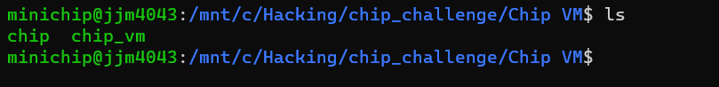

# Chip VM

## Usage

## Concept

- anti-decompile, VM, stack frame, anti-debugging
- 디컴파일러는 항상 정확하지 않습니다. 가장 많이 사용하는 IDA 디컴파일의 경우 C의 관점에서 무의미한 코드라고 판단될 경우에 디컴파일할 때 최적화하여 C 코드로는 해당 무의미한 로직을 보여주지 않습니다. 이번 문제의 핵심 로직 중 하나인 `지역변수를 전역변수처럼 활용하기` 는 C의 관점에서 무의미해 보이는 지역변수 사용이 많기에 이와 관련된 일부 로직이 디컴파일된 코드에서는 나타나지 않게 됩니다. 그리고 이런 케이스는 C 바이너리가 가지는 특징을 크게 벗어나지 않기 때문에 디컴파일러를 신뢰할 수 없다는 사실을 눈치 채기 약간 까다롭게 만듭니다.
- ptrace를 이용하여 anti-debugging 트릭을 구현하였습니다. 다만, 문제의 핵심적인 로직을 숨긴 방법과 동일하게 해당 트릭을 숨겨 놓았기에 동적 분석으로 올바른 결과를 얻기 위해서는 정적 분석이 선행되어야 합니다.

## **Writeup**

### 분석 - 실행해보기



문제는 2개의 파일로 구성되어 있습니다.


chip_vm이 ELF 바이너리, 그리고 chip은 정체 불명의 파일입니다.


chip_vm을 실행해보면 Chip을 insert하라고 합니다. vm이라는 문제 이름처럼 VM류 문제이고, chip 파일은 chip_vm에서 실행 가능한 바이너리로 생각됩니다.


chip을 인자로 실행해주면 약간의 로딩 시간 소요 후 Input을 입력 받습니다.


올바른 입력을 찾는 것이 문제의 목표가 될 것 같습니다.

### 분석 - IDA 정적 분석

**main function**


`sub_1229`를 최초 1회 실행시킨 이후에 while loop에서 chip 파일을 `buf`에 읽어오고 읽어온 값을 인자로 `sub_13F1`을 실행시킵니다. chip파일에서 읽었지만 인자 `buf`에 들어가지 않은 값들도 일부 있는데 이 값들은 인자로 전달하지 않는 대신 전역변수에 기록하고 있습니다.

**sub_1229**


최초 1회 실행되는 `sub_1229`입니다. 바이너리를 실행시킬 때 봤던 “Loading Chip VM…” 문구를 출력하는 로직을 확인할 수 있고, 5초간 sleep하는 것을 확인할 수 있습니다.

그리고 `ptrace`함수가 실행되는 것을 확인할 수 있는데, 리버싱 분야에서는 안티 디버깅 함수로 매우 자주 사용되는 함수입니다. 보통 `ptrace`를 이용한 안티 디버깅 로직에서는 `ptrace`의 리턴값을 통해 디버깅 여부를 판단하는데, 여기서 `ptrace`의 리턴 값은 지역변수 `v1`에 저장되기는 하지만 이 값을 가지고 아무런 동작을 하지 않고 함수는 종료됩니다. 그것 외에는 함수의 인자가 모두 0이므로 `ptrace` 함수 내부에서 아무런 동작을 수행하지 않습니다.

**sub_13F1**


`buf[0]`이 0이 될 때까지, `buf[0]`값을 1씩 감소시키며 `sub_13F1`을 재귀호출합니다.

`buf[0]`의 값이 0이 된 이후에는 `byte_40A0` (chip파일에서 읽어온 값)과 `buf[1]`값에 따라 4가지 분기로 나뉘게 됩니다. `byte_40A0` 값에 따라서는 함수 포인터로 실행한 함수의 리턴값을 그대로 반환하느냐 아니면 local 변수 `v2`값을 반환하느냐가 결정됩니다. `v2` 값은 디컴파일된 코드 상에서 초기화도 되지 않은 더미 값이기 때문에 `v2`값을 반환하는 것이 큰 의미는 없어 보입니다.

그리고 `buf[1]` 값의 여부에 따라서 함수 인자가 달라집니다.

`buf[2]`가 함수 포인터로서 동작하게 되는데,


`buf[2]`의 값은 `main`함수에서 위와 같이 결정됩니다.  `buf[2]`에 들어갈 수 있는 함수 리스트를 살펴보겠습니다.


`qword_4020`을 살펴보면 이렇게 함수 리스트를 볼 수 있습니다.

각 함수들은 매우 유사한 형태를 지니고 있어서 대표적으로 하나만 분석해 보겠습니다.


`a1`은 `buf[3]`, `a2` 는 `buf[1]`이거나 없습니다.

먼저 `buf[3]`의 값이 0이 될 때까지 본인을 재귀호출합니다.

`buf[3]` 값이 0이 되면, `byte_40A0`값에 따라 local 변수인 `v3` 과 `a2` 를 xor해서 반환하거나 `a2` 를 그대로 반환합니다.

<aside>
💡 다른 함수의 경우 8번 line의 연산이 다릅니다. (^, |, +, -, <<, >> 등등)

</aside>

여기까지 분석을 하다 보면 이상한 점을 느껴야 합니다.

local변수 `v3` 이 초기화 되지 않고 사용되고 있습니다. 그리고, 함수의 인자는 2개인데 1개만 인자로 전달하는 부분이 존재했었습니다. 이 부분도 수상하게 느껴져야 합니다.

다시 돌아가서 어셈을 살펴보겠습니다.


여기에 대응하는 어셈은 다음과 같습니다.


`rsi`에는 local 변수가 들어가는 것을 확인할 수 있습니다. 하지만 이 local 변수는 함수 내에서 초기화 되지 않은 값이기 때문에 IDA 디컴파일러가 무의미한 값으로 판단하여 인자로 보여주지 않은 것으로 생각됩니다.

여기까지 보면, 가장 수상한 점은 `초기화되지 않은 local 변수` 입니다. 초기화가 되지 않았지만, 이 값이 유의미한 값이 된 것처럼 사용하는 것을 볼 수 있습니다.

그리고, `sub_1229`(main함수에서 최초 1회 실행된 함수)와 `sub_13F1` 를 포함하여 다른 모든 함수들의 스택 프레임의 크기가 동일합니다.


모든 함수의 프롤로그에서 `sub rsp, 20h` 를 확인할 수 있습니다.


그리고 `main` 함수를 제외한 모든 함수들에서 local 변수의 위치가 `rbp-8` 로 동일한 것을 확인할 수 있습니다.

즉, **어느 함수에서 local 변수를 건드렸다면, 해당 함수가 종료 된 뒤 `main` 으로부터 함수 깊이가 동일한 함수 호출에서 해당 local 변수의 값이 동일하게 유지될 것으로 예상할 수 있습니다.** 함수가 호출되어서 stack frame을 형성할 때, `return address`와 `SFP`값은 새롭게 업데이트 되지만 local 변수에 해당하는 영역은 **초기화가 이루어지지 않기 때문**입니다. 다만 C의 관점에서는 해당 local 변수 값이 아무 의미 없는 더미 값이기 때문에 IDA 디컴파일러도 이를 무의미하게 해석한 것으로 볼 수 있습니다.

이 부분을 파악한다면, 나머지 코드들의 의도를 쉽게 파악할 수 있습니다.

`sub_13F1` 을 다시 보면,


`qword_4020` 배열에 들어 있던 함수들도 다시 확인해보면


`byte_40A0`의 값이 0이면 아무 동작을 하지 않는 것처럼 보이지만,


`byte_40A0`이 0인 경우 숨겨진 동작이 존재하는 것을 확인할 수 있습니다.

local 변수에 `a2`값을 xor하고 있습니다.

종합해 보면, `byte_40A0` 값이 0인 경우 해당 깊이의 local 변수에 `a2` 값을 연산한 결과를 저장하며 `byte_40A0` 값이 1인 경우에는 해당 깊이의 local 변수와 `a2` 값을 연산한 결과를 가져와서 `sub_13F1` 의 깊이에 존재하는 local 변수에 그 결과를 저장합니다.

`byte_40A0` 값의 존재 여부는 어느 쪽이 `dst` 이고 `src` 인지를 정해 주는 것으로 보입니다.

그 외에도 `sub_13F1` 에는 분기가 하나 더 존재 했는데,


`buf[1]` 값의 여부에 따라서, 해당 값이 존재하면 `buf[1]` 값이 피연산자로 사용되고 존재하지 않으면 서로 다른 깊이의 local 변수 2개가 피연산자로 사용됩니다.

`buf[1]` 값은 chip 파일에서 읽어온 값이기에, operand가 상수이냐 아니면 변수이냐의 차이가 되겠네요.

이렇게 되면 모든 코드를 분석하게 됩니다. 분석결과를 토대로 chip 파일을 파싱하는 descriptor를 짤 수 있습니다.

### chip 파일 파싱하기

**descriptor.py**

```python
binary_file = open("chip", "rb")

XOR = 1
PLUS = 2
SUB = 3
ASSIGN = 4
LSHIFT = 5
RSHIFT = 6
OR = 7
AND = 8
PRINT = 9
SCANF = 10
VERIFY = 11

def fread_func(binary):
    buf = binary.read(12)
    while buf:
        opcode = buf[0]
        operand1 = buf[1]
        operand2 = buf[2]
        const = int.from_bytes(buf[3:3+8], "little")
        rev_flag = buf[-1]
        parse_func(opcode, operand1, operand2, const, rev_flag)
        buf = binary.read(12)

def parse_func(opcode, operand1, operand2, const, rev_flag):
    if opcode == XOR:
        print("xor", end=' ')
    elif opcode == PLUS:
        print("plus ", end=' ')
    elif opcode == SUB:
        print("sub ", end=' ')
    elif opcode == ASSIGN:
        print("assign", end=' ')
    elif opcode == LSHIFT:
        print("lshift", end=' ')
    elif opcode == RSHIFT:
        print("rshift", end=' ')
    elif opcode == OR:
        print("or", end=' ')
    elif opcode == AND:
        print("and", end=' ')
    elif opcode == PRINT:
        print("print", end=' ')
    elif opcode == SCANF:
        print("scanf", end=' ')
    elif opcode == VERIFY:
        print("verify", end=' ')
    
    tmp1 = operand1 + 1
    tmp2 = operand1 + operand2 + 2

    if rev_flag == 1:
        dst = tmp1
        src = tmp2
    else:
        dst = tmp2
        src = tmp1
    
    if const == 0:
        print("d[%d], d[%d]"%(dst, src))
    else:
        print("d[%d], %x"%(dst, const))
    
    
fread_func(binary_file)
```


실행하면 이렇게 어셈을 뽑아서 볼 수 있습니다.

상당히 짧으며 해석하기에 어렵지 않습니다.

3가지 stage로 나눌 수 있습니다.

`초기화 및 입력` - `8번의 round` - `검증 및 출력`

### 분석 - chip파일 해석하기

**초기화 단계**

```nasm
and d[2], d[1]
and d[3], d[1]
and d[4], d[1]
and d[5], d[1]
and d[6], d[1]
and d[7], d[1]
and d[8], d[1]
and d[9], d[1]
and d[10], d[1]
and d[11], d[1]
and d[12], d[1]
and d[13], d[1]
and d[14], d[1]
and d[15], d[1]
and d[16], d[1]
and d[17], d[1]
and d[18], d[1]
and d[19], d[1]
and d[20], d[1]
and d[21], d[1]
and d[22], d[1]
and d[23], d[1]
and d[24], d[1]
and d[25], d[1]
and d[26], d[1]
and d[27], d[1]
and d[28], d[1]
and d[29], d[1]
and d[30], d[1]
assign d[2], 203a7475706e49
print d[2], d[1]
plus d[4], deadbeefba53ba11
plus d[5], c001cafec01dcafe
scanf d[6], d[4]
scanf d[7], d[5]
scanf d[8], d[7]
scanf d[9], d[2]
scanf d[10], d[2]
scanf d[11], d[10]
scanf d[12], d[2]
scanf d[13], d[3]
```

d[1]~d[30]까지 초기화 후 “Input:”문자열 출력, 그리고 상수값 저장, 마지막으로 8번 scanf하고 있습니다. scanf 한 번 당 8byte입력이기 때문에 총 64바이트 입력을 받습니다.

여기서 d[1]~d[30]을 d[1]과 and로 초기화하는데, d[1]값은 머리를 잘 굴려야 합니다.

궁금한 마음에 디버깅해보실 수도 있는데,


`main` 함수에서 1의 깊이로 `sub_1229` 가 실행된 바 있습니다. 이 부분을 기억해야 합니다. 여기서의 로컬 변수인 `v1` 는 descriptor에서 해석한 것 중 `d[1]`에 대응되고 그 값은 `ptrace` 의 `return value` 인 0이 됩니다. 하지만 디버깅 환경에서는 -1이 되기 때문에 주의가 필요합니다.

**round 연산 단계**

```nasm
assign d[2], d[4]
and d[2], d[5]
assign d[3], d[6]
xor d[3], d[5]
plus  d[2], d[3]
plus  d[2], c17b0981cbcb2911
assign d[3], d[2]
lshift d[2], 17
rshift d[3], 29
plus  d[2], d[3]
assign d[16], d[2]
```

위 라운드가 8번 반복됩니다.

간단하게 표현하면 다음과 같습니다.

```python
#input[0] = 0xdeadbeefba53ba11
#input[1] = 0xc001cafec01dcafe
#input[2~9] -> scan으로 입력 받은 값 64byte
d[16+i] = ROL_8byte((input[i] & input[i+1]) + (input[i+1] ^ input[i+2]) + const, shift_const)
```

**검증 및 출력 단계**

```python
verify d[16], fe7d99b36f105fa2
verify d[17], 3c16e8bf7331447d
verify d[18], 33aec05c1f49cbeb
verify d[19], 49797ab1431abd06
verify d[20], 93cc67417d204c6
verify d[21], fbc98ad028e831bb
verify d[22], f36d9d20d23cb650
verify d[23], bdbf42bd8cfa63ea
assign d[2], 6e492021444f4f47
print d[2], d[1]
assign d[2], 7920736920747570
print d[2], d[1]
assign d[2], 67616c662072756f
print d[2], d[1]
assign d[2], 6e616320490a2021
print d[2], d[1]
assign d[2], 65696c6562207427
print d[2], d[1]
assign d[2], 7320756f79206576
print d[2], d[1]
assign d[2], 6968742065766c6f
print d[2], d[1]
assign d[2], 656c6c6168632073
print d[2], d[1]
assign d[2], 6e6f43202e65676e
print d[2], d[1]
assign d[2], 74616c7574617267
print d[2], d[1]
assign d[2], a21736e6f69
print d[2], d[1]
```

라운드 연산의 결과를 검증합니다(비교 연산 수행). verify에서는 검증을 통과하지 못하면 다음 instruction이 실행되는 것이 아니라 `exit()`으로 chip_vm 프로세스가 바로 강제 종료됩니다.

검증을 모두 통과하면 여러 문구가 출력되는 것으로 보입니다.

### Exploit

분석한 로직을 토대로 역산을 진행할 수 있습니다. 매우 간단하기 때문에, 자세한 설명은 생략하겠습니다.

```python
res = [
    0x6f6a5365b827ba2,
    0xe52ea9fcb8d25c8f,
    0x4d17522abf5e3908,
    0x9ed80e843fd51b43,
    0x89c1cec64688b2b9,
    0x1dc17ea2483034f4,
    0x7c492d29bd5aa0e4,
    0xeac3dbabe33233eb
]

plus_const = [
    0xc17b0981cbcb2911, 
    0x1b8e1dd9fde575d,
    0x2d91e89ef1250e43,
    0x63a8ee6c21f1c7d3,
    0x26c9e0d8ff9f050e,
    0x7e5438e1a4f4f5b9,
    0x2b6b18f0f8711b15,
    0x5c7990c2794b1f9e
    ]

shift_const = [23, 32, 15, 55, 39, 1, 33, 40, 7]

def ROL8(val, sh):
    tmp = val << sh
    tmp += val >> (64 - sh)
    tmp &= 0xffffffffffffffff
    return tmp

def sub_8byte(a, b):
    tmp = a - b
    if tmp < 0:
        tmp += 0x10000000000000000
    return tmp

def rev_round(x0, x1, val, round):
    tmp = ROL8(val, 64 - shift_const[i])
    tmp = sub_8byte(tmp, plus_const[i])
    tmp1 = x0 & x1
    tmp = sub_8byte(tmp, tmp1)
    tmp ^= x1
    return tmp

rev_data = [0xDEADBEEFBA53BA11, 0xC001CAFEC01DCAFE]
flag = []
for i in range(8):
    tmp = rev_round(rev_data[0], rev_data[1], res[i], i)
    rev_data[0] = rev_data[1]
    rev_data[1] = tmp
    flag.append(tmp)

for i in flag:
    for j in range(8):
        print(chr((i>>(8*j)) & 0xff), end='')
print()
```


`flag: hspace{C_c0d3_c4nn07_3xpr3$S_4ll_op3r47i0ns_of_A_c0mput3r!_HaHa}`

아래는 ptrace를 이용한 anti-debugging 트릭으로 인하여서 gdb에서는 “Wrong Input!”을 출력하는 모습입니다.

